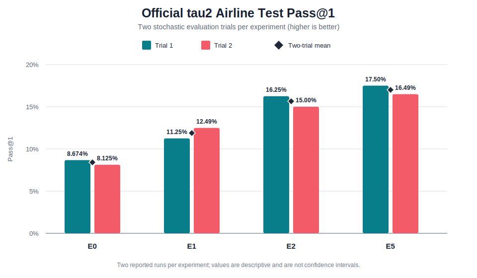
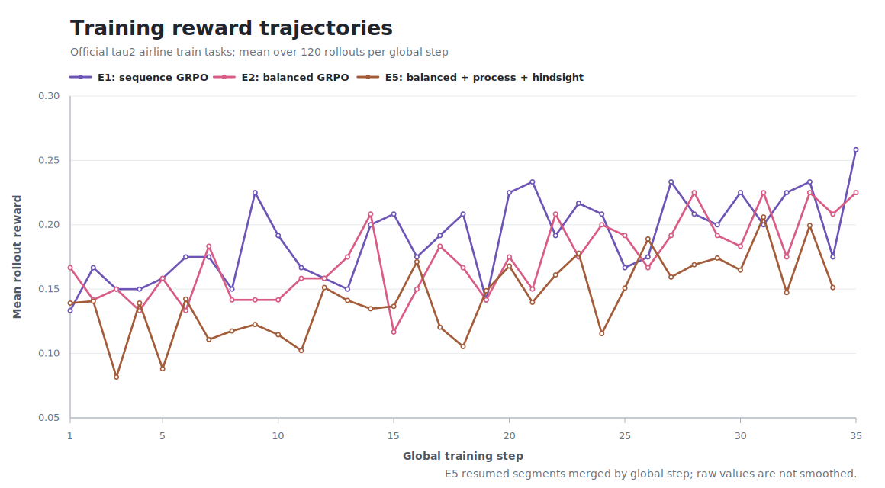

# Agent RL Qwen3

An airline-only agentic reinforcement-learning study built on Qwen3-8B,
[verl](https://github.com/verl-project/verl), vLLM, and the official
[tau2-bench](https://github.com/sierra-research/tau2-bench) environment. The
project compares sequence GRPO, sign-balanced loss aggregation, and lightweight
hindsight turn credit under one locked training and evaluation protocol.

## Research scope

- **Domain:** official tau2 `airline` only.
- **Base policy:** Qwen3-8B with LoRA rank/alpha `64/64`; no SFT stage.
- **Training set:** 30 locked official airline train tasks, one row per task.
- **Final evaluation:** 20 disjoint official airline test tasks at seeds
  `42`, `43`, `44`, and `45` (80 episodes per checkpoint).
- **Training horizon:** at most 64 agent turns per episode.
- **Evaluation horizon:** tau2's 200-step text-run limit.
- **GRPO sampling:** four trajectories per task (`G=4`).
- **Formal runs:** 75 optimizer steps, saved every five steps with one retained
  actor checkpoint.

The task IDs, evaluation seeds, and pinned tau2 commit are defined in
[`configs/data/airline_official.json`](configs/data/airline_official.json).
Training code cannot read the official test split, and evaluation outcomes are
not used to continue the same training run.

## Experiment matrix

| ID | Loss aggregation | Scalar reward | Turn credit | Role |
| --- | --- | --- | --- | --- |
| E0 | none | none | none | frozen base-model evaluation |
| E1 | sequence mean | outcome | none | standard GRPO baseline |
| E2 | sign-balanced | outcome | none | balanced-GRPO comparison |
| E3 | sequence mean | outcome + process | none | process-reward ablation |
| E4 | sequence mean | outcome | hindsight | credit-only ablation |
| E5 | sign-balanced | outcome + light process | hindsight | combined method |

E1, E2, and E5 are the formal comparison. E3 and E4 isolate the two E5
components. Every trained experiment starts independently from the same base
model; E2 and E5 are not initialized from E1.

## Official airline results

The following results are `Pass@1` on the locked official tau2 airline test
set. Each experiment has two reported stochastic evaluation trials.



| Experiment | Trial 1 | Trial 2 | Two-trial mean |
| --- | ---: | ---: | ---: |
| E0 | 0.08674 | 0.08125 | 0.08400 |
| E1 | 0.11250 | 0.12490 | 0.11870 |
| E2 | 0.16250 | 0.15000 | 0.15625 |
| E5 | 0.17500 | 0.16490 | 0.16995 |

The two-run mean rises from `0.08400` for the frozen E0 baseline to `0.11870`
for E1, `0.15625` for E2, and `0.16995` for E5. E5 is highest in both reported
trials. With only two trials per experiment, these values support a descriptive
comparison but not a statistical-significance claim.

### Training reward trajectories

The curves below are training diagnostics, not official evaluation scores. Each
point is the mean scalar rollout reward over one `30 x 4 = 120` trajectory
batch. E5's three resumed segments are joined by their persisted global step;
the raw values are not smoothed. In these runs, `critic/score/mean` and
`critic/rewards/mean` are identical, so the duplicate dashboard series is
plotted only once.




### What changes in E2 and E5

- **Sign-balanced aggregation** computes the positive- and negative-advantage
  trajectory losses separately before combining them. It changes loss
  aggregation, not tau2's binary outcome reward or PPO's token-level ratio and
  clipping.
- **Light process reward** adds a `0.1`-weighted, bounded score from
  environment-verifiable evidence such as invalid actions, tool failures,
  unresolved errors, and successful recovery. Repeated calls are diagnostic,
  not automatically penalized.
- **Hindsight credit** assigns post-trajectory turn weights using the sign of
  the GRPO advantage and process evidence, broadcasts those weights to response
  tokens, clips them to `[0.05, 3.0]`, and normalizes their trajectory mean to
  one. It is a heuristic credit assignment rule, not a learned PRM or causal
  estimator.

## Safety and comparability

- The policy receives public policy text, tool schemas, user messages, and tool
  observations only. Hidden task or evaluator fields are never rendered into
  model messages.
- Every episode creates a fresh tau2 environment and database state. Parallel
  trajectories do not share mutations.
- Asynchronous collection uses a batch barrier so all four members of a GRPO
  group come from the same frozen policy version.
- A lightweight context compressor preserves the system prompt, tool contract,
  latest user state, unresolved tool calls, and recent interaction suffix. The
  project does not implement long-term memory.
- Terminal or boundary tool calls without a tau2 result are retained as
  explicit failed evidence instead of crashing the whole rollout batch.

## Runtime

The validated remote profile targets one NVIDIA RTX PRO 6000 Blackwell GPU
(96 GB), Python 3.12, PyTorch with CUDA, vLLM `0.24.0`, and editable pinned
`tau2-bench` and `verl` submodules. DeepSeek V4 Pro is used at temperature zero
for both the tau2 user simulator and evaluator.

Clone submodules and install the unified environment:

```bash
git submodule update --init --recursive

# uv must already be available. Override ENV_PREFIX when needed.
bash scripts/setup/install_runtime.sh

source /root/miniconda3/etc/profile.d/conda.sh
conda activate /root/autodl-tmp/conda-envs/agent-rl-train
set -a && source .env && set +a
```

The default runtime paths are under `/root/autodl-tmp`. Set at least the
DeepSeek API credentials in `.env`; never commit that file. If training is
resumed after a restart, apply
[`patches/verl_checkpoint_retention.patch`](patches/verl_checkpoint_retention.patch)
to the pinned verl submodule so the previously loaded checkpoint is removed
only after the next checkpoint is saved successfully.
